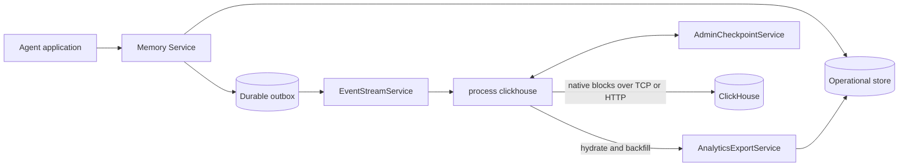

# Enhancement 404: ClickHouse analytics export

> **Status**: Proposed.
>
> This enhancement specifies the design requested by [GitHub issue #567](https://github.com/chirino/memory-service/issues/567).

## Summary

Add an independently deployable `memory-service process clickhouse` process that copies
conversation, entry, lineage, episodic-memory, and lifecycle data into ClickHouse. The
processor runs outside the Memory Service request path. It consumes the durable event
outbox through `EventStreamService.SubscribeEvents`, writes client-side batches with
`clickhouse-go/v2`, and records safe progress through `AdminCheckpointService`.

The repository's ready-to-run deployments enable a pinned ClickHouse server and one
processor replica by default. This includes `compose.yaml` and both top-level Kustomize
examples under `deploy/kustomize/overlays/`. Other production deployments remain free to
omit the analytics components.

The integration provides generic tables that work for every supported record. Operators
can also define immutable, versioned projections selected by an exact entry
`contentType` or memory `kind`. A projection writes approved, typed fields into its own
table without replacing the generic record.

One implementation supports both self-managed ClickHouse and ClickHouse Cloud. The
project verifies only a pinned local ClickHouse server. ClickHouse Cloud is configuration
compatible, but is not part of project CI or the verified support matrix.

ClickHouse is a separate persistence and trust boundary. Export does not preserve Memory
Service field-level encryption. The processor therefore supports `metadata`, `projected`,
and `full` payload modes. The repository examples use `metadata`. `projected` is the
recommended mode for domain analytics. `full` requires an explicit operator
acknowledgment that decrypted content will be stored outside Memory Service.

## Motivation

The operational stores are designed for agent memory access, authorization, replay,
forking, and search. They are not designed for large scans, long-term trend analysis, or
high-cardinality dashboards. Direct analytical queries can compete with request traffic
and expose datastore-specific schemas to reporting applications.

A separate ClickHouse copy lets users:

- build dashboards without loading the operational datastore
- measure conversation volume, active users, client and agent activity, entry channels,
  content types, fork behavior, and retention trends
- analyze memory creation, revision, use, expiration, archival, and eviction over time
- report on typed domain fields such as task outcomes, tool calls, customer attributes,
  and application events
- keep a generic record when no content-specific projection exists
- recover after processor or ClickHouse outages by replaying the durable outbox
- choose self-managed ClickHouse or ClickHouse Cloud based on cost, residency,
  compliance, and operational needs

## User stories

- As an operator, I can enable analytics without adding ClickHouse latency or
  availability dependencies to Memory Service writes.
- As an analyst, I can query stable generic tables without knowing which operational
  datastore stores the source records.
- As an application owner, I can publish a versioned projection for one exact entry
  content type or memory kind and receive typed ClickHouse columns.
- As a security owner, I can choose which decrypted data crosses into the analytics
  boundary and audit the selected mode.
- As a platform owner, I can stop and restart the processor without silent gaps or
  unbounded duplicate results.
- As a self-managed user, I can connect through native TCP or HTTP and control storage,
  backups, users, and retention.
- As a ClickHouse Cloud user, I can use the same processor and schema without a separate
  cloud-specific implementation.

## Goals

- Keep ClickHouse completely off the Memory Service request path.
- Export a current-state analytical replica and an append-only lifecycle event log.
- Cover conversations, entries, conversation lineage, and episodic memories.
- Backfill records that predate retained outbox history.
- Resume from a durable checkpoint with at-least-once delivery.
- Make ordinary retries idempotent at the logical row and batch levels.
- Provide generic schemas and optional typed projections.
- Propagate archive, expiration, eviction, and hard-delete state.
- Make privacy boundaries and unsupported security claims explicit.
- Support both ClickHouse connection protocols offered by `clickhouse-go/v2`.
- Make the default Compose and Kustomize examples immediately queryable without an
  additional analytics profile or manual processor deployment.

## Non-goals

- Distributed exactly-once delivery across Memory Service and ClickHouse.
- An exact event-time snapshot of every version of a mutable source record.
- Synchronous dual writes from Memory Service request handlers to ClickHouse.
- A general change-data-capture framework for arbitrary destinations.
- A second analytics database in the first release.
- Project CI against ClickHouse Cloud.
- Automatic verification of ClickHouse disk, backup, cache, or temporary-file
  encryption.
- Arbitrary SQL, table names, or ClickHouse types derived from entry or memory content.
- Analytical query APIs served by Memory Service.

## Terminology

| Term | Meaning |
| --- | --- |
| Source event | A durable Memory Service outbox event. |
| Generic record | A row in a standard table that is independent of content type or memory kind. |
| Projection | An immutable rule that extracts approved typed fields from one exact content type or memory kind. |
| Safe cursor | The newest source cursor for which every required ClickHouse write has been acknowledged. |
| Frozen batch | A bounded in-memory set of source events and derived rows retried unchanged during one process run. |
| Ingest version | A monotonic version composed from a lease generation and batch sequence. |
| Exporter ID | A stable identifier that isolates one logical analytics export in shared tables. |
| Tombstone | A newer current-state row with `is_deleted=1` and no exported payload. |
| Payload mode | The `metadata`, `projected`, or `full` boundary selected by the operator. |

## Design

### Architecture



Memory Service commits a source mutation and its outbox event together where the backing
store supports an atomic transaction. The processor reads those events through the
existing admin gRPC stream. It enriches generic records from the current source entity,
applies configured projections, and inserts batches into ClickHouse. It then advances the
checkpoint.

This follows the processor model in [Enhancement 102](102-event-processor-turn-traces.md).
It does not add a ClickHouse plugin to the server write path.

### Product semantics

The first release exports two related datasets:

1. `memory_service_lifecycle_events` is an append-only fact log of retained outbox
   notifications. It records that a lifecycle operation occurred.
2. Generic and projection tables are versioned current-state replicas. They record the
   newest source state that the processor could resolve.

The existing outbox stores normalized identifiers, not complete entity snapshots. The
analytics export service resolves the current entity when the event is processed. An
entity can change again or be hard-deleted before a lagging processor resolves it.
Therefore, this design does not claim to reconstruct the exact payload at every
historical transition.

Entries are immutable after creation, so their resolved content normally represents the
created state. Conversations and memories are mutable and follow current-state semantics.
Every source event is still represented in the lifecycle table even when the associated
full record no longer exists. Such a lifecycle row has `snapshot_available=0`.

### Deployment and support matrix

The processor is a separately scalable process:

```text
memory-service process clickhouse
```

One active process owns a given `exporter_id` and checkpoint client ID. Multiple
processors can export to different databases or with different payload policies by using
different IDs. A compare-and-swap checkpoint lease prevents two replicas from owning the
same ID during a rollout. The supplied deployments use one replica per ID.

| Target | Configuration support | Project verification |
| --- | --- | --- |
| Self-managed ClickHouse | Supported | Verified against a pinned local container |
| ClickHouse Cloud | Supported through the same driver settings | Compatible, not project-tested |

The local test stack uses the exact ClickHouse image tag in `compose.yaml`. At the time
of this proposal, that tag is `clickhouse/clickhouse-server:26.8.2.7`. Tests must not use
an unpinned `latest` image.

Production analytics requires a primary datastore and event transport that support
durable replay through the gRPC event stream. PostgreSQL and MongoDB are both required
because the supplied Kustomize examples cover both datastores. The implementation must
complete [Enhancement 091](091-mongo-outbox-transactions.md) before enabling the
processor in the MongoDB overlay. Tail-only operation is allowed only with an explicit
development flag and reports an unhealthy durability status.

`compose.yaml` starts ClickHouse and the processor without a profile. The existing
Langfuse profile reuses the server through a separate database and user. A new
`deploy/kustomize/components/analytics/clickhouse` owns the self-managed ClickHouse
StatefulSet, persistent volume claim, and Service.
`deploy/kustomize/components/processor/clickhouse` owns the processor Deployment,
configuration, and demo Secret. Both top-level overlays include both components; the kind
overlays inherit them. A ClickHouse Cloud deployment omits the server component and
patches the processor endpoint and TLS Secret. Reference credentials and
pseudonymization keys are development values and the operator documentation requires
their replacement outside local examples.

### Source event contract

The processor subscribes with admin scope to these event kinds:

| Kind | Purpose |
| --- | --- |
| `conversation` | Conversation creation, title or metadata update, archive, unarchive, eviction, and hard delete. |
| `entry` | Immutable entry creation and later eviction or hard delete. |
| `memory` | Memory creation, revision, archive, expiration, eviction, and hard delete. |

Lineage is hydrated as part of a conversation export. It does not introduce a separate
public event kind because fork creation already produces a conversation event and the
ancestry closure is read through the analytics export contract.

The outbox action stays compatible with its existing `created`, `updated`, and `deleted`
values. A stable `change` field in the event data identifies the more precise lifecycle
operation:

| Action | Example `change` values |
| --- | --- |
| `created` | `created`, `forked` |
| `updated` | `updated`, `archived`, `unarchived`, `expired` |
| `deleted` | `evicted`, `hard_deleted` |

Every analytics source event must include:

- the durable cursor and source occurrence time
- the resource kind and resource identifier
- the conversation and conversation-group identifiers when applicable
- the exact lifecycle `change`
- identifiers needed to write a tombstone after the source entity is gone
- the entry `channel` and `contentType` when applicable
- the memory kind and revision when applicable

gRPC `EventNotification` gains an additive `occurred_at` timestamp, and the SSE envelope
gains the equivalent `occurredAt` field. Replay populates it from
`OutboxEvent.CreatedAt`, and live outbox events preserve the same timestamp instead of
using the processor's receive time. The processor can record receive time separately as
`observed_at`.

Event data remains lightweight. It must not contain raw entry content, memory values,
titles, credentials, or attachment bytes.

The implementation adds outbox events to every episodic-memory mutation path. Reads do
not synchronously append analytics events. The processor periodically samples cumulative
memory usage through the admin export contract and writes a usage snapshot. This keeps a
ClickHouse dependency and per-read outbox amplification off the fetch path. Bulk
expiration and eviction must append lifecycle events before removing source records.

PostgreSQL and SQLite must append mutation and outbox data atomically. The core MongoDB
store must use replica-set transactions for the mutation and outbox append, and its
outbox must support ordered replay and stale-cursor detection. These are prerequisites
for enabling the processor in the MongoDB Kustomize example.

### Analytics export contract

The processor always subscribes with `detail=summary`. The existing `detail=full` event
payload is an internal serialization, omits fields needed by analytics, and would make
the processor depend on unstable Go model JSON. It is not the analytics source contract.

Add an admin-only gRPC `AnalyticsExportService` with two bounded operations:

- `GetAnalyticsRecords` accepts up to 1,000 typed resource references from source events
  and returns current records in request order.
- `ListAnalyticsRecords` performs stable, paginated backfill for conversations, entries,
  lineage, and memories. Its page token binds the resource kind, payload mode, filters,
  and last stable sort key.

Both operations accept `METADATA` or `FULL`. `projected` mode requests `FULL`, evaluates
the projection in processor memory, and discards unprojected plaintext. `metadata` mode
requests `METADATA`, whose protobuf messages do not contain titles, entry content,
memory values, or user-controlled metadata values outside the configured allowlist.
Deleted resources return `snapshot_available=false` rather than failing the complete
batch. Responses are capped by item count and encoded bytes.

This service is intentionally gRPC-only. It is a privileged, processor-oriented bulk
feed, not a user-facing resource API, and duplicating it in the agent or admin REST API
would broaden the exposed plaintext surface without serving an interactive use case. It
requires the existing admin role, a dedicated processor client identity, and a logged
justification.

A server-side projection mode is not part of the first release. Server-side projection
would reduce plaintext exposure in a separately deployed processor, but it would also
require projection distribution, execution, and version pinning inside every Memory
Service replica.

The selected compromise is:

- `metadata` mode never requests decrypted payloads.
- `projected` mode receives decrypted source data over the protected gRPC connection,
  holds it only in memory, and persists only approved projected fields.
- `full` mode receives and persists the decrypted source fields.
- checkpoints, logs, metrics, operation events, and dead-letter rows never contain source
  payloads.

A later enhancement can add server-side projection without changing the ClickHouse
generic schema or projection naming contract.

### Bootstrap and backfill

`after_cursor=start` begins at the oldest retained event. It does not include entities
created before the retained outbox window. A complete initial export therefore needs a
current-state backfill and a race-free boundary between the scan and live changes.

The event stream gains a durable high-water mark on its `phase=live` notification. The
marker contains the current outbox cursor even when the stream has not emitted a business
event. The backing outbox store must expose this high-water mark without inventing a
comparable public cursor. The cursor remains opaque to clients.

An initial bootstrap runs as follows:

1. Open a tail subscription and obtain the current durable high-water cursor from the
   live-phase marker.
2. Persist that cursor as `backfillStartCursor` in the processor checkpoint.
3. Page through `AnalyticsExportService.ListAnalyticsRecords` and write current
   conversations, lineage, entries, and memories as backfill batches.
4. Persist page tokens and completed resource phases in the checkpoint. Backfill restarts
   from those tokens after interruption.
5. When the scan completes, subscribe strictly after `backfillStartCursor` and replay all
   changes that occurred during the scan.
6. Mark bootstrap complete only after the replay reaches the live phase and all resulting
   ClickHouse batches are acknowledged.

Backfill batches receive lower ingest versions than replay batches, so a replayed
mutation supersedes a stale value observed during the scan. If the start cursor becomes
stale before replay completes, the processor stops with `backfill_required`; it does not
silently jump to the tail. The operator can rerun a new idempotent backfill.

Backfill includes archived conversations and active historical entry branches. It exports
only source records that still exist. Records hard-deleted before the boundary cannot be
recovered. That limitation is reported in the bootstrap completion operation event.

### Checkpoint schema

The processor stores a versioned checkpoint:

```text
application/vnd.memory-service.clickhouse-checkpoint+json;v=1
```

Example:

```json
{
  "version": 1,
  "exporterId": "primary-analytics",
  "projectionSetDigest": "sha256:...",
  "safeCursor": "pg:00000000000000000420",
  "bootstrap": {
    "state": "complete",
    "backfillStartCursor": "pg:00000000000000000100"
  }
}
```

The checkpoint contains identifiers, cursors, scan positions, and hashes only. It is capped
at 64 KiB and does not grow with batch size. Bootstrap page tokens are opaque and bind
only scan position and filters. The checkpoint does not contain titles, entry content,
memory values, metadata values, projected values, or SQL.

The processor runtime uses a commit-then-checkpoint contract:

1. Freeze a bounded batch in memory.
2. Send all table batches and the final batch commit marker.
3. After ClickHouse acknowledges the marker, advance `safeCursor` and save the
   checkpoint.

During one process run, an ambiguous insert retries the same frozen rows, batch ID, and
insertion tokens. After a restart, the processor subscribes after `safeCursor` and may
form different batch boundaries or hydrate a newer current snapshot. It uses a new batch
ID. Stable logical event IDs and canonical current-state ordering make that replay
idempotent. Rows from a partially written batch have no commit marker, remain invisible
to canonical views, and are removed by a scheduled orphan cleanup after a grace period.

`AdminCheckpointService` gains an opaque revision, compare-and-swap updates, and
`AcquireLease`, `RenewLease`, and `ReleaseLease` operations. The service stores a hashed
lease token, monotonic generation, and expiry beside the encrypted checkpoint payload.
It evaluates expiry with the datastore clock so pod clock skew cannot create two owners.
The processor stops before its lease can expire if renewal fails. Existing checkpoint
callers retain last-write-wins behavior on checkpoints with no active lease. A write to a
leased checkpoint requires its lease token and expected revision.

Each batch receives an `ingest_version` composed from the lease generation and a 32-bit
batch sequence. A new owner increments the generation before it can write, so a replay
after a crash is newer than a batch that committed before the safe-cursor save. The
processor must reacquire a lease before the batch sequence can overflow.

### Delivery and duplicate handling

The end-to-end guarantee is at-least-once. The processor does not describe the result as
exactly-once because the source checkpoint and ClickHouse writes do not share a
transaction, and ClickHouse insert-deduplication history is finite.

Each source event gets a stable ID:

```text
SHA-256(exporter_id + "\n" + source_cursor + "\n" + kind + "\n" + event + "\n" + change)
```

Each frozen batch gets a cryptographically random 32-byte ID encoded as 64 lowercase hex
characters. It remains stable for retries during that process run. Each table insert
uses a deterministic `insert_deduplication_token` derived from the batch ID and table
schema version.

The processor must send the same rows in the same order when retrying a frozen batch in
the same process run.
Self-managed non-replicated deployments must configure a positive
`non_replicated_deduplication_window`. The schema readiness check rejects a zero window
unless the operator explicitly accepts weaker retry behavior.

Generic current-state tables use `ReplacingMergeTree(ingest_version)` and stable sorting
keys. A canonical view filters to committed batches and selects the latest row by
`(ingest_version, event_id)`, so correctness does not depend on background merge timing.
This limits the effect of a retry that falls outside the ClickHouse deduplication window.

ClickHouse does not provide a transaction across all target tables. The processor writes
`memory_service_ingest_batches` last. All exported rows include `batch_id`, and canonical
views include only rows whose batch has a committed marker. The processor advances
`safeCursor` only after ClickHouse acknowledges that marker.

### Batching and backpressure

Default batch limits are:

| Limit | Default |
| --- | --- |
| Source events | 10,000 |
| Encoded rows | 100,000 |
| Encoded bytes | 8 MiB |
| Maximum delay | 1 second |

The first reached limit freezes the batch. Limits are configurable and bounded. One
oversized source record can form a single batch up to a separate maximum-record limit.
In `full` mode, a larger source record stops the processor with `record_too_large`; it
cannot fall back to a generic row without silently violating the selected export policy.
In `projected` mode, a projection output over the limit follows the projection failure
policy while the metadata-only generic row remains exportable.

The processor has one bounded in-memory batch and one bounded receive buffer. It stops
reading the gRPC stream when those limits are reached, which applies transport
backpressure. It never spills decrypted data to local disk. ClickHouse errors keep the
batch frozen and retry with exponential backoff and jitter. Source lag can grow while
ClickHouse is unavailable, so the outbox retention period must exceed the maximum planned
outage plus backfill duration.

The processor sets `async_insert=0` explicitly. Client-side batching plus synchronous
`Batch.Send` acknowledgment defines the checkpoint boundary. A future opt-in asynchronous
mode must set `wait_for_async_insert=1` and prove retry behavior before it can advance a
checkpoint.

### ClickHouse driver and protocol

Use `github.com/ClickHouse/clickhouse-go/v2` through its native client API:

- `clickhouse.Open`
- `PrepareBatch`
- `Append` or `AppendStruct`
- `Send`

Do not use `database/sql`, row-at-a-time inserts, or `JSONEachRow` for the primary ingest
path. The driver sends ClickHouse native blocks over either supported transport.

| Protocol | Default port | Intended use |
| --- | --- | --- |
| Native TCP | `9000`, or `9440` with TLS | Default and preferred when direct connectivity is available. |
| HTTP or HTTPS | `8123`, or commonly `8443` with TLS | Networks and proxies that do not allow native TCP. |

The port is configuration, not a deployment-type switch. The processor does not infer
`self-managed` or `cloud`. TLS is on by default for every non-loopback address. Disabling
TLS remotely requires an explicit insecure-development acknowledgment.

### Schema ownership and migrations

The processor can run in either schema mode:

- `manage`: create the database objects and apply forward-only versioned migrations
- `validate`: require a separately provisioned schema and only verify compatibility

Production deployments should use separate ClickHouse roles for migration and ingestion.
The steady-state ingest role needs `INSERT` and limited metadata-read permissions, not
`ALTER USER`, `DROP DATABASE`, or broad administrative rights.

`memory_service_schema_migrations` records the component version, migration ID,
checksum, and application time. Migrations are additive by default. A breaking table
change creates a new physical table and view version, backfills it, switches the canonical
view, and retains the old table for a documented rollback period. An upgrade never
assumes that ClickHouse can be reset.

### Generic schema

All physical tables are placed in a configured database and use a fixed prefix. Neither
resource content nor source metadata controls an identifier.

| Table | Engine | Purpose |
| --- | --- | --- |
| `memory_service_schema_migrations` | `MergeTree` | Applied schema versions and checksums. |
| `memory_service_projection_registry` | `ReplacingMergeTree` | Projection name, digest, selector, generated table, and state. |
| `memory_service_ingest_batches` | `ReplacingMergeTree` | Logical commit markers for frozen batches. |
| `memory_service_lifecycle_events` | `ReplacingMergeTree` | Durable lifecycle facts keyed by stable event ID. |
| `memory_service_conversations` | `ReplacingMergeTree` | Versioned current conversation rows and tombstones. |
| `memory_service_conversation_lineage` | `ReplacingMergeTree` | Ancestor, descendant, depth, and fork-point rows. |
| `memory_service_entries` | `ReplacingMergeTree` | Immutable entry rows and deletion tombstones. |
| `memory_service_memories` | `ReplacingMergeTree` | Versioned memory rows, use counters, and tombstones. |
| `memory_service_memory_usage_snapshots` | `MergeTree` | Periodic cumulative memory usage facts. |
| `memory_service_projection_failures` | `ReplacingMergeTree` | Payload-free projection failure records. |
| `memory_service_purge_queue` | `ReplacingMergeTree` | Durable purge requests and completion state. |

Every data table has these columns:

| Column | Type | Meaning |
| --- | --- | --- |
| `exporter_id` | `String` | Stable export identity. |
| `batch_id` | `FixedString(64)` | Frozen batch identity. |
| `event_id` | `FixedString(64)` | Stable source-event identity, or stable synthetic backfill identity. |
| `source_cursor` | `String` | Opaque outbox cursor, empty for backfill rows. |
| `ingest_version` | `UInt64` | Lease generation in the high 32 bits and batch sequence in the low 32 bits. |
| `observed_at` | `DateTime64(9, 'UTC')` | When the processor observed the state. |
| `identity_key_version` | `LowCardinality(String)` | Operator label for the HMAC key used by this row. |
| `schema_version` | `UInt16` | Row schema version. |

Unless a column is explicitly named `source_*`, identifier columns contain the stable
HMAC-derived analytics ID. Nullable `source_*` identifier columns exist only in `full`
mode when raw identifier export is acknowledged. This keeps joins useful without making
raw operational identifiers the default analytics key.

#### Lifecycle events

`memory_service_lifecycle_events` adds `occurred_at`, `resource_kind`, `analytics_resource_id`,
`action`, `change`, `conversation_id`, `conversation_group_id`, `content_type`,
`memory_kind`, `snapshot_available`, and `summary_json`.

`summary_json` is canonical JSON stored as `String`, not ClickHouse's dynamic `JSON` type.
The event shape is small and controlled, while `String` avoids creating dynamic paths from
user metadata. Frequently queried values have dedicated typed columns.

The table partitions by `toYYYYMM(occurred_at)` and sorts by
`(exporter_id, resource_kind, occurred_at, event_id)`. A retried event uses the same
`occurred_at`, so all versions of that event stay in one partition.

#### Conversations

Conversation rows include:

- `conversation_id`, `conversation_group_id`, and `owner_user_id`
- `client_id` and nullable `agent_id`
- `created_at`, `updated_at`, and nullable `archived_at`
- `is_archived` and `is_deleted`
- nullable `title` according to payload mode
- canonical `metadata_json` according to payload mode

The sorting key is `(exporter_id, conversation_id)`. The table is not time-partitioned so
all versions of one conversation share a replacement key.

#### Conversation lineage

Lineage rows mirror the ancestry closure source of truth rather than deprecated direct
fork fields. Columns include `ancestor_conversation_id`, `descendant_conversation_id`,
`depth`, nullable `forked_at_entry_id`, `conversation_group_id`, and `is_deleted`. The
sorting key is the exporter plus ancestor and descendant IDs.

#### Entries

Entry rows include:

- `entry_id`, `conversation_id`, and `conversation_group_id`
- `channel`, `content_type`, and nullable `role`
- nullable `user_id`, `client_id`, and `agent_id`
- `created_at` and `is_deleted`
- canonical nullable `metadata_json`
- canonical nullable `content_json` according to payload mode

Attachment bytes are never exported. Content can contain attachment identifiers and
non-secret media metadata only when allowed by the selected payload mode.

The sorting key is `(exporter_id, entry_id)`.

#### Memories

Memory rows include:

- `memory_id` and an HMAC-derived `logical_memory_id`
- `memory_kind`, `revision`, and lifecycle timestamps
- `created_at`, `updated_at`, nullable `expires_at`, and nullable `archived_at`
- `is_archived`, `is_expired`, and `is_deleted`
- canonical nullable `attributes_json`, `metadata_json`, and `value_json` according to
  payload mode

`logical_memory_id` is derived from the namespace and key with a dedicated analytics
pseudonymization key. Raw namespace and key values are not part of metadata mode. Key
rotation creates a new pseudonymization version and requires a controlled re-backfill if
cross-version linkage is needed.

The same key derives stable analytics IDs for users, conversations, groups, entries, and
memory records. `metadata` and `projected` modes store those pseudonyms instead of raw
source IDs. `full` mode may store raw IDs only when `allowRawIdentifiers=true`; the
default is false. The HMAC input is domain-separated by resource type so equal source
strings do not correlate across identifier classes.

The sorting key is `(exporter_id, logical_memory_id)`. `revision` remains available for
current-state conflict analysis; historical value payloads are outside this design.

`memory_service_memory_usage_snapshots` contains `logical_memory_id`, cumulative
`fetch_count`, nullable `last_fetched_at`, and `sampled_at`. It is append-only and
partitions by `toYYYYMM(sampled_at)`. Sampling is eventually consistent and is not an
audit log of individual reads.

### Canonical views and materialized views

The processor creates canonical views such as
`memory_service_conversations_current`. These views:

- filter to committed batch IDs
- select the latest committed row by `(ingest_version, event_id)` with a tested
  `argMax` query
- exclude tombstones from the default current view
- expose separate `*_all` views when analysts need archived or deleted state

`ReplacingMergeTree` merges are asynchronous. Consumers must not query a physical table
and assume duplicates are already removed.

Incremental materialized views process inserted blocks. They do not automatically correct
an aggregate after a later source-table replacement, merge, mutation, or tombstone.
Therefore, the integration does not create naive incremental count or sum views over
current-state tables. Operators can use:

- incremental views over the append-only, logically deduplicated lifecycle stream when
  the aggregation tolerates its event semantics
- refreshable views over canonical current-state views
- version-aware `argMax` aggregation with tests for updates and deletes

The documentation must call out this rule in every dashboard example.

### Typed projections

Projection definitions are deployment-owned YAML loaded by the processor. They are not
accepted from entry content or memory values.

```yaml
apiVersion: memory-service/v1alpha1
kind: AnalyticsProjection
metadata:
  name: support-ticket/v1
spec:
  resource: entry
  selector:
    contentType: support-ticket/v1
  columns:
    outcome:
      type: string
      nullable: false
    latencyMs:
      type: uint64
      nullable: true
    tags:
      type: string_array
      nullable: false
  projectionRego: |
    package memoryservice.analytics
    output := {
      "outcome": input.content.outcome,
      "latencyMs": object.get(input.content, "latencyMs", null),
      "tags": object.get(input.content, "tags", []),
    }
```

Each projection:

- has one canonical immutable name in `family/vN` form
- selects either one exact entry `contentType` or one exact memory `kind`
- has a content digest stored in the checkpoint and projection registry
- defines columns from an allowlisted portable type system
- writes one row per matching generic record into a dedicated versioned table
- never replaces the generic row

Supported initial field types are `string`, `bool`, `int64`, `uint64`, `float64`,
`timestamp`, `string_array`, and `json_string`. The implementation maps those types to
fixed ClickHouse types. A deployment creates a new projection version to add, remove, or
change a column.

Configured column names must match `^[a-z][a-z0-9_]{0,62}$` and must not use reserved
names. Physical table names are generated from a sanitized family plus a digest suffix.
The processor quotes every validated identifier. Selector values never become SQL
identifiers.

Projection Rego receives a bounded typed input containing the generic resource fields and
the decrypted source payload available under the selected mode. It has no network, file,
clock, random, or database capabilities. Output must exactly match declared columns,
types, nullability, string-size limits, and array-size limits.

For memory records, the existing immutable `MemoryKindVersion` attributes are the default
typed projection when their fields are sufficient. The processor can map those already
computed attributes directly without re-running the memory value projection. A separate
`AnalyticsProjection` is required when analytics needs a different schema. This keeps
`MemoryKindVersion` responsible for operational memory attributes instead of adding
ClickHouse-specific concerns to it.

Changing the active projection set while a frozen batch exists is rejected. After the
batch commits, a new projection set starts with a new digest and table version.
Historical projection backfill is an explicit command, not an automatic startup side
effect.

### Projection failures

The generic record remains authoritative when a projection does not match, returns an
invalid result, or exceeds a limit.

The default `continue-generic` policy writes the generic row and a payload-free record to
`memory_service_projection_failures`. That record includes event ID, pseudonymous
analytics resource ID, projection name, stable error code, attempt count, and timestamps.
It does not include
the source payload, Rego source, raw error, namespace, key, or projected values.

An optional `stop` policy keeps the batch frozen and reports the processor unready until
the projection or source record is corrected. The retry count is bounded and exposed as a
metric. A replay command can reprocess selected failure event IDs after a projection fix.

### Lifecycle, deletion, and retention

Lifecycle changes are represented in both the fact log and current-state tables:

| Source change | ClickHouse behavior |
| --- | --- |
| Archive or unarchive | Insert a newer current-state version with the new flags. |
| Memory expiration | Record `change=expired`, then insert an expired row or tombstone according to source behavior. |
| Eviction | Record `change=evicted` and insert a tombstone. |
| Hard delete | Record `change=hard_deleted`, insert a tombstone, and enqueue a required physical purge. |
| Retention timeout | Apply table TTL independently according to analytics policy. |

Current views hide tombstoned rows immediately after the committed replacement is
visible. Old physical parts can still contain prior plaintext until ClickHouse merges or
deletes them. Every hard-delete batch inserts a request into
`memory_service_purge_queue` before its commit marker. A worker issues targeted
`ALTER TABLE ... DELETE` mutations for generic and projection tables, coalesces requests
to control rewrite cost, and tracks them through `system.mutations`. It marks a request
complete only after every affected table reports completion, and records only
pseudonymous IDs and stable status codes. The queue makes a crash after checkpoint
advancement recoverable. Purge is required in every payload mode because identifiers and
projected fields can still be personal data. It is not immediate cryptographic erasure,
and it cannot erase independent backups or replicas that are outside the configured
ClickHouse cluster.

Analytics retention is explicit per table class:

- lifecycle-event retention
- current-state tombstone retention
- generic payload retention
- projection-table retention
- projection-failure retention

The processor never assumes that source retention automatically removes ClickHouse data.
Full and projected export documentation must require operators to configure ClickHouse
tables, replicas, object storage, snapshots, backups, caches, and disaster-recovery copies
to satisfy the same or stricter deletion policy.

### Encryption and privacy

Memory Service encrypts selected operational fields before writing them to its primary
store. The processor receives authorized plaintext after Memory Service decrypts those
fields. Writing that plaintext or any derivative to ClickHouse creates a second at-rest
copy outside the Memory Service encryption envelope.

| Mode | Exported content | Source detail | Intended use |
| --- | --- | --- | --- |
| `metadata` | Pseudonymous IDs, routing fields, timestamps, lifecycle fields, approved non-content metadata | `METADATA` export records | Strictest boundary and operational metrics. |
| `projected` | Metadata plus explicitly released typed projection fields | `FULL` export records, discarded after projection | Recommended domain analytics. |
| `full` | Decrypted titles, entry content, memory values, and allowed metadata | `FULL` export records | Trusted analytics environments that need raw content. |

All modes export pseudonymous resource IDs, routing fields, lifecycle state, and
timestamps. User-controlled metadata values export only for keys on an
operator allowlist; the default allowlist is empty. Conversation titles export only in
`full`. Generic entry content and memory values export only in `full`. In `projected`,
released entry and memory fields appear only in the matching projection table, while
reusable `MemoryKindVersion` attributes can appear as declared typed projection fields.

`full` mode refuses to start unless `allowDecryptedContent=true`. Raw source identifiers
also require `allowRawIdentifiers=true`. Startup emits a
payload-free admin audit record containing the exporter ID, mode, destination host class,
and configuration digest. It never records credentials or content.

`projected` mode protects ClickHouse from storing the unprojected payload, but the
processor still handles that plaintext in memory. Deployments that cannot grant the
processor full-read authority must use `metadata` mode until server-side projection is
implemented.

Remote gRPC and ClickHouse connections require TLS by default. Credentials come from
environment variables, mounted secret files, or the existing secret-resolution
mechanism. Passwords are not accepted as ordinary CLI arguments because process listings
and shell history can expose them.

Self-managed operators are responsible for ClickHouse storage policies, encrypted disks,
filesystem encryption, object-storage encryption, backups, temporary files, logs,
replicas, user roles, and key rotation. ClickHouse disk encryption is not equivalent to
Memory Service field-level encryption because ClickHouse queries and privileged operators
can still read plaintext columns.

### Configuration

Representative settings are:

| Setting | Default | Purpose |
| --- | --- | --- |
| `--client-id` | required | Admin checkpoint identity. |
| `--exporter-id` | value of `--client-id` | Stable row namespace. |
| `--endpoint` | required | Memory Service gRPC endpoint, shared with other processors. |
| `--grpc-tls` | automatic | Required for non-loopback Memory Service endpoints. |
| `--grpc-ca-file` | system roots | Custom Memory Service CA bundle. |
| `--allow-insecure-grpc` | `false` | Explicit development acknowledgment for remote plaintext gRPC. |
| `--clickhouse-address` | required | One or more ClickHouse endpoints. |
| `--clickhouse-protocol` | `native` | `native` or `http`. |
| `--clickhouse-database` | `memory_service` | Target database. |
| `--clickhouse-username` | required | Ingest or migration user. |
| `--clickhouse-password-file` | unset | Mounted credential file. |
| `--clickhouse-tls` | automatic | Required for non-loopback endpoints. |
| `--clickhouse-ca-file` | system roots | Custom CA bundle. |
| `--allow-insecure-clickhouse` | `false` | Explicit development acknowledgment for remote plaintext ClickHouse. |
| `--schema-mode` | `manage` | `manage` or `validate`. |
| `--payload-mode` | `metadata` | `metadata`, `projected`, or `full`. |
| `--allow-decrypted-content` | `false` | Required acknowledgment for `full`. |
| `--allow-raw-identifiers` | `false` | Required acknowledgment before storing raw source IDs. |
| `--pseudonymization-key-file` | required | Stable HMAC key for analytics identifiers; never accepted inline. |
| `--pseudonymization-key-version` | `v1` | Non-secret label stored with rows for controlled key rotation. |
| `--metadata-key` | none | Repeatable allowlist entry for exported user metadata. |
| `--projection-file` | repeatable | Projection manifests. |
| `--memory-usage-snapshot-interval` | `15m` | Interval for cumulative memory usage facts; `0` disables snapshots. |
| `--batch-events` | `10000` | Source-event limit. |
| `--batch-rows` | `100000` | Encoded-row limit. |
| `--batch-bytes` | `8MiB` | Encoded-byte limit. |
| `--batch-delay` | `1s` | Maximum collection delay. |
| `--tail-only-development` | `false` | Explicitly bypass durable replay and backfill. |

Environment-variable names follow the normal Memory Service CLI binding convention.
Secrets must be redacted from diagnostics and configuration dumps.

### Failure handling

| Failure | Behavior |
| --- | --- |
| ClickHouse unavailable | Keep the frozen batch, retry with bounded exponential backoff, and do not advance the safe cursor. |
| Ambiguous insert result | Retry the identical table block with the same insertion token. |
| One table succeeds and another fails | Retry the complete logical batch; canonical views ignore it until the commit marker exists. |
| Checkpoint save fails after commit | Keep retrying the checkpoint save without consuming; after a process restart, replay after the prior safe cursor under a newer lease generation. |
| Source cursor is stale | Stop with `backfill_required`; never jump to tail automatically. |
| Projection error | Follow `continue-generic` or `stop`; never persist the source payload in the failure row. |
| Oversized full record | Stop with `record_too_large`; never silently omit selected content. |
| Purge request pending | Keep current views tombstoned, retry from the durable purge queue, and report purge delay. |
| Schema mismatch | Refuse readiness before consuming events. |
| Credential or TLS error | Fail startup with a sanitized error. |
| Shutdown | Stop receiving, flush within the shutdown deadline, save safe state, and report cancellation rather than failure. |

There is no local payload dead-letter file. Generic data plus the payload-free projection
failure table provides a retry reference without creating an unmanaged plaintext copy.

### Health, metrics, and operational logging

Readiness is false during schema incompatibility, bootstrap failure, stale-cursor state,
loss of the checkpoint lease, or when lag exceeds a configured
maximum. A temporary ClickHouse outage can use a separate degraded threshold before it
makes readiness false. Liveness reports only whether the process can continue its retry
loop.

Metrics include:

- source events and exported rows by kind, action, table, and result
- committed batches, retries, insert duration, encoded bytes, and rows per batch
- source lag seconds and last safe checkpoint age
- current buffered events, rows, and bytes
- bootstrap phase, pages, rows, duration, and restarts
- projection successes and failures by projection and stable error code
- stale-cursor, schema-mismatch, and lease-loss counts
- deletion and compliance-purge delay

Metrics must not use conversation IDs, user IDs, content types with unbounded cardinality,
memory kinds with unbounded cardinality, namespaces, keys, or content as labels.

The process owns one canonical `job.process.clickhouse` operation for its run. It emits at
most one start record and one terminal record. Retry attempts can emit
`job.process.clickhouse.insert` records with `retrying` results. Operation events use
typed, bounded fields for exporter ID, phase, batch row count, retry count, protocol,
payload mode, and stable failure reason. They never include endpoints with credentials,
raw driver errors, SQL, cursors, entity IDs, metadata, namespaces, keys, or payloads.

Connection state changes and retry-loop transitions can remain point logs. Recovered
panics follow `internal/operationevent` recovery rules and retain stacks only in the
separate diagnostic log.

### Analytics sink abstraction

The first release does not expose a public generic analytics-sink API. ClickHouse table
management, insert tokens, engines, and native batches are destination-specific, and a
premature public interface would either leak ClickHouse concepts or hide required
semantics.

The implementation should keep derivation separate from delivery through a small internal
boundary:

```go
type BatchSink interface {
    Validate(context.Context, SchemaPlan) error
    Commit(context.Context, FrozenBatch) error
    Close(context.Context) error
}
```

`FrozenBatch` contains typed generic and projection rows, not raw event envelopes. The
interface is internal and can change when a second analytics database supplies evidence
for a stable abstraction.

### Compatibility and rollout

The server-side export APIs and processor remain opt-in capabilities in custom
deployments and do not add ClickHouse to the request path. The repository's Compose and
Kustomize examples enable ClickHouse and the processor by default in `metadata` mode.
Adding the `memory` kind is additive to the event contract. Existing subscribers that
request explicit kinds do not receive it. Subscribers that request all kinds must
tolerate new kind values as already required for an extensible stream.

Rollout phases are:

1. Add memory outbox events, MongoDB transactional replay, live-phase high-water
   cursors, checkpoint compare-and-swap leases, and focused replay tests.
2. Add the bounded analytics export service, ClickHouse schema management, generic
   tables, metadata mode, backfill, and required purge queue.
3. Enable the pinned ClickHouse and metadata processor by default in Compose and both
   Kustomize examples, then verify rendered deployments locally.
4. Add projected mode, immutable projection manifests, and projection-failure handling.
5. Add full mode with explicit acknowledgments and end-to-end deletion-purge tests.
6. Publish operator documentation and dashboard-safe query examples.

Upgrades preserve existing ClickHouse tables and checkpoints. A checkpoint content-type
version mismatch fails with migration guidance. Downgrade behavior is documented per
schema migration and must never silently rewrite a newer checkpoint.

## Testing

### Unit tests

- Stable event IDs are deterministic across restarts.
- A frozen batch keeps the same batch ID, row order, and insertion tokens for in-process
  retries.
- `Snapshot` never advances `safeCursor` before the commit marker succeeds.
- Size, row, count, and timer limits freeze a bounded batch.
- Metadata mode never requests or encodes decrypted fields.
- Full mode refuses startup without `allowDecryptedContent`.
- Raw identifiers never export without `allowRawIdentifiers`.
- Checkpoint compare-and-swap permits only one unexpired lease owner.
- A new lease generation produces ingest versions above every batch from the prior owner.
- Checkpoint size remains bounded at the maximum source-event batch size.
- Projection selectors match exact content types or memory kinds only.
- Projection output enforces type, nullability, name, string, and array limits.
- MemoryKindVersion attributes map without re-running the source projection.
- Logs, metrics, checkpoints, and failure rows do not contain payloads or credentials.
- Current views handle replacement rows and tombstones correctly.

### Integration tests

The project uses a pinned local ClickHouse container. It does not call ClickHouse Cloud.
The required source matrix is PostgreSQL and MongoDB durable outbox replay to local
ClickHouse over native TCP because those are the two published Kustomize examples.
Focused tests also cover the driver's HTTP transport. TLS tests use a local test CA.

```gherkin
Feature: ClickHouse analytics export

  Scenario: Initial backfill closes the live-update gap
    Given durable PostgreSQL outbox replay is enabled
    And a conversation, entry, fork, and memory exist before the processor starts
    When the ClickHouse processor captures a high-water cursor and starts backfill
    And the conversation is archived during backfill
    Then ClickHouse contains the generic backfill records
    And the replayed archive row supersedes the backfill conversation row
    And the processor checkpoint reaches the live phase without a gap

  Scenario: Acknowledged batches advance the checkpoint
    Given the processor has frozen a batch ending at cursor "cursor-20"
    When ClickHouse acknowledges every table insert and the batch commit marker
    Then the checkpoint safe cursor becomes "cursor-20"

  Scenario: A partial batch is retried safely
    Given ClickHouse acknowledges the lifecycle table insert
    And the connection fails before the entry table insert is acknowledged
    When the processor reconnects
    Then it sends the same ordered rows with the same insertion tokens
    And canonical views expose the batch only after its commit marker exists
    And one logical lifecycle event is visible by event ID

  Scenario: A stale cursor requires a new backfill
    Given the checkpoint cursor is older than retained outbox history
    When the ClickHouse processor resumes
    Then it stops with reason "backfill_required"
    And it does not subscribe from the current tail

  Scenario: Projected mode releases only declared fields
    Given an entry projection for content type "support-ticket/v1"
    And the entry contains a declared outcome and an undeclared secret
    When the processor exports the entry in projected mode
    Then the generic entry row does not contain full content
    And the projection row contains the outcome
    And no ClickHouse table, checkpoint, log, or failure row contains the secret

  Scenario: Full mode requires explicit acknowledgment
    Given payload mode is "full"
    And allowDecryptedContent is false
    When the ClickHouse processor starts
    Then startup fails before it subscribes to events

  Scenario: Memory lifecycle reaches ClickHouse
    Given a memory is created, fetched, revised, expired, and evicted
    When the processor consumes all memory events
    And the memory usage sampler runs
    Then the lifecycle table records each mutation change
    And the usage snapshot records the cumulative fetch count
    And the current memory view excludes the final tombstone

  Scenario: HTTP transport uses native block batches
    Given a local ClickHouse HTTPS endpoint signed by the test CA
    And the processor protocol is "http"
    When a batch is exported
    Then ClickHouse acknowledges the batch over HTTPS
    And the checkpoint advances after the acknowledgment

  Scenario: Default Compose stack exports metadata
    Given no Compose profile is selected
    When the default stack becomes healthy
    And an entry is appended through Memory Service
    Then ClickHouse and the ClickHouse processor are running
    And the entry appears in the canonical metadata view

  Scenario Outline: Kustomize examples enable analytics
    Given the "<overlay>" Kustomize example is rendered
    When it is deployed to a local kind cluster
    Then ClickHouse and the ClickHouse processor become ready
    And a source mutation reaches the canonical metadata view

    Examples:
      | overlay |
      | postgresql-infinispan |
      | mongodb-redis |
```

### Failure and upgrade tests

- Kill the processor before send, during one table send, after the commit marker, and
  before the final checkpoint save.
- Restart ClickHouse during a batch and verify bounded retry and no silent cursor advance.
- Exhaust the insert deduplication window and verify canonical views still return one
  logical current row.
- Apply every ClickHouse migration to the previous supported schema without data loss.
- Change a projection digest under the same version and verify startup rejects it.
- Rotate credentials and TLS certificates without logging secret material.
- Verify archive, unarchive, expiration, eviction, hard delete, and compliance-purge
  timing.
- Start two processors with one exporter ID and verify only the lease owner consumes.
- Render both top-level Kustomize overlays and their kind wrappers, and validate all
  resource references before the local kind smoke test.

## Security considerations

- The processor needs admin event, analytics-export, and checkpoint privileges. Use a
  dedicated identity with no agent API authority.
- The ClickHouse user follows least privilege and is separate from the schema migration
  user where practical.
- Projection Rego is sandboxed, deterministic, bounded, and capability-free.
- TLS certificate verification is on for non-loopback endpoints.
- Credential values never appear in flags, logs, metrics, checkpoints, operation events,
  table comments, or migration history.
- The pseudonymization key is a mounted secret, is never logged, and must differ between
  deployments that must not be correlatable.
- Generic JSON is canonicalized and size-limited before insertion.
- Identifiers used in SQL come only from validated configuration and fixed templates.
- Full or projected export broadens the trusted computing base to the processor,
  ClickHouse, its storage, its backups, and every principal with column access.
- ClickHouse encryption at rest does not restore Memory Service field-level isolation.

## Resolved design decisions

- Checkpoint ownership uses an explicit renewable compare-and-swap lease. Client-ID
  restriction alone does not prevent overlapping pods during a rollout.
- The durable purge queue ships with metadata mode and applies to every payload mode.
  Projected fields and identifiers can be personal data even when raw content is absent.
- A dedicated bounded gRPC analytics export service handles hydration and backfill. The
  existing event `detail=full` shape and interactive admin list APIs are not bulk-export
  contracts.
- Both published Kustomize datastore examples must provide durable replay before their
  default analytics processor is considered ready. This makes MongoDB transaction and
  replay support part of this enhancement rather than a documented best-effort gap.

## Tasks

- [ ] Add durable `memory` lifecycle events for create, revision, archive, expiration,
  eviction, and hard delete.
- [ ] Add periodic cumulative memory usage export without writes on the fetch path.
- [ ] Add a durable high-water cursor to the live-phase event marker.
- [ ] Complete [Enhancement 091](091-mongo-outbox-transactions.md), including
  transactional MongoDB mutations and outbox appends, ordered replay, stale-cursor
  detection, and the MongoDB gRPC outbox test suite.
- [ ] Extend the processor runtime with bounded commit-then-checkpoint batching, orphan
  cleanup, and an explicit safe resume cursor.
- [ ] Add checkpoint revisions, compare-and-swap updates, and renewable ownership leases.
- [ ] Add the admin-only, bounded `AnalyticsExportService` for batch hydration and stable
  paginated backfill.
- [ ] Add `memory-service process clickhouse` lifecycle API and CLI wrapper.
- [ ] Add `clickhouse-go/v2` native client integration for native and HTTP protocols.
- [ ] Add schema migration and validation modes.
- [ ] Create generic lifecycle, conversation, lineage, entry, memory, memory-usage, and
  purge-queue tables.
- [ ] Create committed-batch canonical current-state views.
- [ ] Implement bootstrap, paginated backfill, replay catch-up, and stale-cursor recovery.
- [ ] Implement deterministic event IDs, stable in-process batch IDs and insertion
  tokens, monotonic ingest versions, and deterministic row ordering.
- [ ] Implement metadata, projected, and full payload modes.
- [ ] Add HMAC-derived analytics identifiers, secret-file configuration, and explicit
  acknowledgments for decrypted content and raw identifiers.
- [ ] Add immutable projection manifest parsing, validation, Rego execution, and registry.
- [ ] Reuse MemoryKindVersion attributes when they satisfy a memory projection.
- [ ] Add projection failure records and replay tooling.
- [ ] Add lifecycle tombstones, retention settings, a durable purge worker, and purge
  completion monitoring.
- [ ] Add TLS, secret-file, least-privilege, and startup security checks.
- [ ] Add health, metrics, canonical operation events, and privacy-safe diagnostics.
- [ ] Add pinned local ClickHouse native, HTTP, TLS, replay, failure, and upgrade tests.
- [ ] Move the pinned `clickhouse` service out of the Langfuse-only Compose profile,
  replace its data `tmpfs` with a named development volume, isolate the analytics and
  Langfuse databases and users through idempotent init scripts, and add a default
  `clickhouse-processor` service in metadata mode with a dedicated admin API-key client,
  explicit local-plaintext acknowledgments, health checks, and dependencies.
- [ ] Add `deploy/kustomize/components/analytics/clickhouse` with a pinned ClickHouse
  StatefulSet, persistent storage, Service, probes, and NetworkPolicy.
- [ ] Add `deploy/kustomize/components/processor/clickhouse` with the processor
  Deployment, probes, configuration, dedicated admin API-key client patch, explicit
  local-plaintext acknowledgments, and demo Secret. Document how a Cloud deployment
  omits the server component and supplies a TLS endpoint and Secret.
- [ ] Include both components by default from the PostgreSQL/Infinispan and MongoDB/Redis
  top-level overlays; verify that both kind overlays inherit them.
- [ ] Add Compose and local kind smoke tests that write a source record and query it from
  the canonical ClickHouse metadata view for both datastore examples.
- [ ] Document self-managed setup, ClickHouse Cloud-compatible configuration, query
  semantics, retention, encryption boundaries, and verified support limits.
- [ ] Update this enhancement as implementation choices or support status change.

## Files to modify

| Area | Expected changes |
| --- | --- |
| `contracts/protobuf/memory/v1/memory_service.proto` | Event timestamp, checkpoint revisions, analytics export service, event-kind documentation, and live-phase high-water contract. |
| `contracts/openapi/` | Additive SSE event timestamp and event-kind contract changes. |
| `internal/registry/eventbus/plugin.go` | Preserve the source occurrence timestamp through live delivery. |
| `internal/service/eventstream/` | Shared memory event normalization, replay capability, and occurrence-time preservation. |
| `internal/grpc/` | gRPC event handling, live-phase high-water cursor, checkpoint compare-and-swap, and analytics export service. |
| `internal/registry/store/event_outbox.go` | Durable high-water cursor capability. |
| `internal/plugin/store/postgres/` | Atomic memory outbox writes, export queries, checkpoint revisions, and high-water cursor. |
| `internal/plugin/store/sqlite/` | Atomic memory outbox writes, export queries, checkpoint revisions, and high-water cursor. |
| `internal/plugin/store/mongodb/` | Transactional core writes, ordered outbox replay, export queries, checkpoint revisions, and high-water cursor. |
| `internal/cmd/process/runtime/` | Commit-then-checkpoint lifecycle, CAS leases, TLS, and safe-cursor semantics. |
| `internal/cmd/process/clickhouse/` | Processor, backfill, schemas, projections, batching, and sink. |
| `internal/cmd/commands/` | ClickHouse process command and lifecycle wrapper. |
| `internal/operationevent/` | Allowlisted ClickHouse processor job names and typed fields if required. |
| `internal/bdd/` | Durable outbox and ClickHouse processor scenarios. |
| `internal/testutil/` | Pinned local ClickHouse and TLS test fixtures. |
| `compose.yaml` | Default pinned ClickHouse and processor services with isolated analytics and Langfuse databases. |
| `deploy/kustomize/components/analytics/clickhouse/` | Self-managed ClickHouse storage, service, network policy, and health resources. |
| `deploy/kustomize/components/processor/clickhouse/` | Processor deployment, configuration, authentication, and health resources. |
| `deploy/kustomize/overlays/*/kustomization.yaml` | Include the analytics component in each published datastore example. |
| `deploy/kustomize/envs/kind/` | Local overlay patches and smoke-test support for analytics. |
| `Taskfile.yml` | Local processor development and focused verification commands. |
| `go.mod`, `go.sum` | `clickhouse-go/v2` dependency. |
| `site/` | Operator configuration, security boundary, schemas, and query guidance. |

The exact store files depend on the event and episodic-store interfaces selected during
implementation. Generated contract files change through the repository generation
workflow rather than by hand.

## Verification

Run focused package tests while implementing each phase, then run the supported Go and
site suites sequentially:

```bash
go test -race ./internal/cmd/process/runtime ./internal/cmd/process/clickhouse -count=1
go test -race ./internal/service/eventstream ./internal/operationevent -count=1
go test ./internal/bdd -run '^TestFeaturesPg(Outbox|ClickHouse)$' -count=1
go test ./internal/bdd -run '^TestFeaturesMongo(Outbox|ClickHouse)$' -count=1
docker compose config --quiet
kubectl kustomize deploy/kustomize/overlays/postgresql-infinispan >/dev/null
kubectl kustomize deploy/kustomize/overlays/mongodb-redis >/dev/null
kubectl kustomize deploy/kustomize/envs/kind/overlays/postgresql-infinispan >/dev/null
kubectl kustomize deploy/kustomize/envs/kind/overlays/mongodb-redis >/dev/null
go build ./...
task test:go > test-go.log 2>&1
rg -n 'ERROR|FAIL|panic|--- FAIL:' test-go.log
task test:site > test-site.log 2>&1
rg -n 'ERROR|FAIL|panic|--- FAIL:' test-site.log
```

Before the final implementation commit, regenerate contracts and formatting through the
repository workflow and verify that generated changes are included:

```bash
task generate
git diff --check
```

Do not run the Go and site suites concurrently in the same worktree.

## References

- [ClickHouse Go integration](https://clickhouse.com/integrations/go)
- [ClickHouse insert retry and deduplication guidance](https://clickhouse.com/blog/common-getting-started-issues-with-clickhouse)
- [ClickHouse current-state deduplication guidance](https://clickhouse.com/resources/engineering/clickhouse-optimize-table-final)
- [ClickHouse incremental materialized-view behavior](https://clickhouse.com/resources/engineering/clickhouse-vs-postgresql-analytics)
- [ClickHouse immutable parts and delete mutations](https://clickhouse.com/resources/engineering/what-is-columnar-storage)
- [Memory Service event outbox enhancement](090-event-outbox.md)
- [MongoDB transactional event outbox enhancement](091-mongo-outbox-transactions.md)
- [Memory Service checkpointed processor enhancement](102-event-processor-turn-traces.md)
- [Memory Service memory-kind versioning enhancement](implemented/115-episodic-policy-versioning-and-migration.md)
- [Memory Service encryption documentation](../encryption.md)
